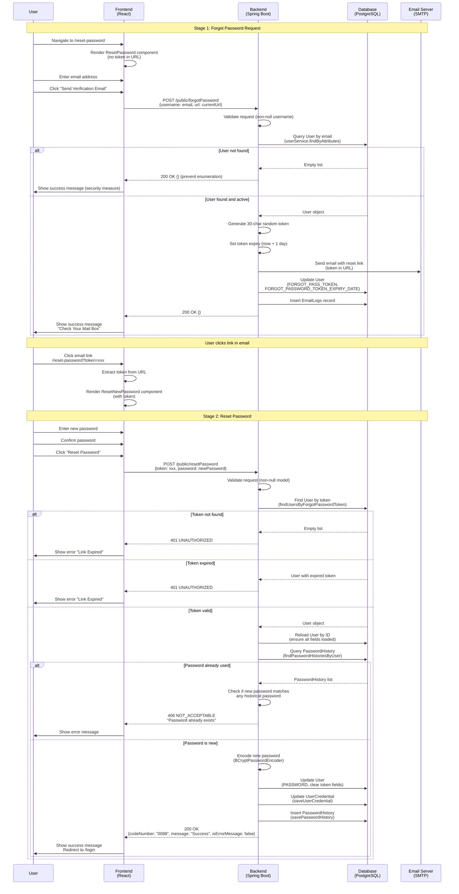

# Reset Password Flow - Complete Documentation

## Overview
The reset password flow allows users to reset their password when they forget it. The process involves two main stages:
1. **Forgot Password**: User requests a password reset via email
2. **Reset Password**: User uses the token from email to set a new password

---

## Sequence Diagram



---

## Data Flow Diagram

```
┌─────────────────────────────────────────────────────────────────┐
│                    FORGOT PASSWORD FLOW                          │
└─────────────────────────────────────────────────────────────────┘

User Input (Email)
    │
    ▼
[Frontend: ResetPassword Component]
    │ POST /public/forgotPassword
    │ Payload: {username: string, url: string}
    ▼
[Backend: LoginRestController.forgotPassword()]
    │
    ├─► Validate: username not null/empty
    │
    ├─► Query: userService.findByAttributes({userEmail: username})
    │   │
    │   └─► [Database: SA_USER table]
    │       WHERE USER_EMAIL = username
    │
    ├─► If user found AND deleteFlag != true:
    │   │
    │   ├─► userService.updateForgotPasswordToken(user, jwtRequest)
    │   │   │
    │   │   ├─► Generate random 30-char token
    │   │   ├─► Set expiry = now + 1 day
    │   │   ├─► Send email via SMTP (EmailSender.send())
    │   │   │   ├─► To: user.getUserEmail()
    │   │   │   ├─► Subject: "Reset Password"
    │   │   │   └─► Body: Template with reset link
    │   │   │       Link: url + "/reset-password?token=" + token
    │   │   │
    │   │   └─► Update User:
    │   │       SET FORGOT_PASS_TOKEN = token
    │   │       SET FORGOT_PASSWORD_TOKEN_EXPIRY_DATE = expiry
    │   │
    │   └─► Insert EmailLogs:
    │       INSERT INTO EMAIL_LOGS
    │       (created_by, email_to, module_name, base_url, ...)
    │
    └─► Response: 200 OK {} (always, to prevent user enumeration)


┌─────────────────────────────────────────────────────────────────┐
│                      RESET PASSWORD FLOW                         │
└─────────────────────────────────────────────────────────────────┘

User Input (New Password + Token from URL)
    │
    ▼
[Frontend: ResetNewPassword Component]
    │ POST /public/resetPassword
    │ Payload: {token: string, password: string}
    ▼
[Backend: LoginRestController.resetPassword()]
    │
    ├─► Validate: resetPasswordModel not null
    │
    ├─► Query: userJpaRepository.findUsersByForgotPasswordToken(token)
    │   │
    │   └─► [Database: SA_USER table]
    │       WHERE FORGOT_PASS_TOKEN = token
    │
    ├─► Validate: token exists AND not expired
    │   │
    │   └─► Check: forgotPasswordTokenExpiryDate > now()
    │
    ├─► Reload User: userService.findByPK(userId)
    │   │
    │   └─► [Database: SA_USER table] (ensure all fields loaded)
    │
    ├─► Query PasswordHistory:
    │   │
    │   └─► passwordHistoryRepository.findPasswordHistoriesByUser(user)
    │       │
    │       └─► [Database: PASSWORD_HISTORY table]
    │           WHERE USER_ID = userId
    │
    ├─► Check: Is new password in history?
    │   │
    │   └─► For each PasswordHistory:
    │       BCryptPasswordEncoder.matches(newPassword, historyPassword)
    │       │
    │       └─► If match: Return 406 NOT_ACCEPTABLE
    │
    ├─► Encode new password: BCryptPasswordEncoder.encode(password)
    │
    ├─► Update User:
    │   │
    │   └─► userService.update(user, userId)
    │       │
    │       └─► [Database: SA_USER table]
    │           SET USER_PASSWORD = encodedPassword
    │           SET FORGOT_PASS_TOKEN = NULL
    │           SET FORGOT_PASSWORD_TOKEN_EXPIRY_DATE = NULL
    │
    ├─► Save User Credential & History:
    │   │
    │   └─► userRestHelper.saveUserCredential(user, encodedPassword)
    │       │
    │       ├─► Update UserCredential:
    │       │   │
    │       │   └─► [Database: USER_CREDENTIAL table]
    │       │       UPDATE SET PASSWORD = encodedPassword
    │       │       WHERE USER_ID = userId
    │       │
    │       └─► Insert PasswordHistory:
    │           │
    │           └─► passwordHistoryRepository.savePasswordHistory(...)
    │               │
    │               └─► [Database: PASSWORD_HISTORY table]
    │                   INSERT (USER_ID, PASSWORD, CREATED_DATE, ...)
    │                   VALUES (userId, encodedPassword, now(), ...)
    │
    └─► Response: 200 OK {codeNumber: "0088", message: "Success", isErrorMessage: false}
```

---

## 🔴 DEBUGGING HIGHLIGHTS - WHERE WE LOSE VISIBILITY

### Critical Issue: 500 Error on `/public/forgotPassword`

**Status:** ❌ **CURRENTLY FAILING** - Returns 500 Internal Server Error without CORS headers

**Where Visibility Stops:**
1. ✅ **Method Entry Point**: Method `forgotPassword()` is being called (confirmed via Hibernate queries in logs)
2. ✅ **Database Query**: `userService.findByAttributes()` executes successfully (Hibernate queries visible)
3. ❌ **After Database Query**: No logger messages appear after line 69, suggesting exception occurs between:
   - Line 69: `List<User> userList = userService.findByAttributes(attribute);`
   - Line 84: `tokenUpdated = userService.updateForgotPasswordToken(user, jwtRequest);`
4. ❌ **Exception Details**: No exception stack trace visible in logs, even with:
   - Debug logging enabled
   - `System.out.println` statements
   - Global exception handlers
   - Custom error controllers

**Hypothesis:**
- Exception likely occurs in `userService.updateForgotPasswordToken()` method
- Exception happens **during** the method execution but **before** it completes
- Spring Boot's error handler creates a new response object that bypasses our CORS filter
- Exception might be happening during:
  - Email sending (SMTP connection failure)
  - User entity update (Hibernate session issues)
  - Response serialization (after method completes)

**Key Observation:**
- Empty request `{}` → Returns 401 with CORS headers ✅ (works)
- Request with username → Returns 500 without CORS headers ❌ (fails)
- This suggests the exception occurs **only when a user is found** and processing begins

**Areas to Investigate:**
1. `UserServiceImpl.updateForgotPasswordToken()` - Line 114-132
   - Token generation
   - Email sending (SMTP)
   - User entity update with `persist(user)` - **SUSPECT**: Using `persist()` on existing user entity
2. User entity state - Might be detached from Hibernate session
3. Email service configuration - SMTP settings might be causing exception
4. Response serialization - Exception during JSON conversion

---

## API Endpoints

### 1. POST /public/forgotPassword

⚠️ **CURRENT STATUS: RETURNING 500 ERROR WITHOUT CORS HEADERS**

**Source:** Frontend (`apps/frontend/src/screens/reset_password/screen.jsx`)
**Target:** Backend (`apps/backend/src/main/java/com/simpleaccounts/rest/Logincontroller/LoginRestController.java`)

**Request Payload:**
```json
{
  "username": "user@example.com",
  "url": "http://localhost:3000/reset-password"
}
```

**Success Response (200 OK):**
```json
{}
```

**Error Responses:**
- **400 BAD_REQUEST**: If `username` is null or empty
  - Response: `"Bad Request"` or `"Username is required"`

**Security Note:** Always returns 200 OK to prevent user enumeration, even if user doesn't exist.

**Backend Processing:**
1. ✅ Validates request (non-null username) - **WORKS**
2. ✅ Queries user by email: `userService.findByAttributes({userEmail: username})` - **WORKS** (confirmed via logs)
3. 🔴 **IF USER FOUND AND ACTIVE** - **FAILS HERE**:
   - ❌ Generates 30-character random token - **UNCERTAIN** (might work)
   - ❌ Sets token expiry to current time + 1 day - **UNCERTAIN**
   - ❌ Sends email via SMTP with reset link - **SUSPECT**: Email sending might fail
   - ❌ Updates User table: `FORGOT_PASS_TOKEN`, `FORGOT_PASSWORD_TOKEN_EXPIRY_DATE` - **SUSPECT**: `persist(user)` called on existing user entity
   - ❌ Inserts EmailLogs record - **NEVER REACHED**
4. ❌ Returns 200 OK {} - **NEVER REACHED** (returns 500 instead)

**🔴 CRITICAL ISSUE IN CODE:**

Looking at `UserServiceImpl.updateForgotPasswordToken()` (line 114-132):
```java
public boolean updateForgotPasswordToken(User user, JwtRequest jwtRequest) {
    String token = randomString.getAlphaNumericString(30);
    try {
        emailSender.send(...);  // ⚠️ If this throws exception, returns false
    } catch (MessagingException e) {
        logger.error(LOG_ERROR, e);
        return false;  // ⚠️ BUT token is not saved!
    }
    
    user.setForgotPasswordToken(token);
    user.setForgotPasswordTokenExpiryDate(dateUtils.add(LocalDateTime.now(), 1));
    persist(user);  // 🔴 SUSPECT: persist() on existing user entity!
    return true;
}
```

**Problems Identified:**
1. `persist(user)` is called on an **existing user entity** - should use `update()` instead
2. If email sending fails, method returns `false`, but in controller this exception is caught and ignored
3. User entity might be **detached** from Hibernate session, causing `persist()` to fail
4. Exception from `persist()` might not be properly caught and logged

**Exception Flow:**
- Exception occurs in `updateForgotPasswordToken()` → Caught in controller (line 86-89) → Logged as warning → Continues to EmailLogs → But method returns 200 OK {} → **ACTUAL ISSUE**: Exception is re-thrown or occurs during response

---

### 2. POST /public/resetPassword

**Source:** Frontend (`apps/frontend/src/screens/reset_password/sections/reset_new_password.jsx`)
**Target:** Backend (`apps/backend/src/main/java/com/simpleaccounts/rest/Logincontroller/LoginRestController.java`)

**Request Payload:**
```json
{
  "token": "abc123...xyz789",
  "password": "NewPassword123!"
}
```

**Success Response (200 OK):**
```json
{
  "codeNumber": "0088",
  "message": "Password Created Successfully.",
  "isErrorMessage": false
}
```

**Error Responses:**

| Status Code | Condition | Response Body |
|------------|-----------|---------------|
| **400 BAD_REQUEST** | Request body is null | Empty body |
| **401 UNAUTHORIZED** | Token not found or expired | Empty body |
| **404 NOT_FOUND** | User not found after reload | Empty body |
| **406 NOT_ACCEPTABLE** | Password already exists in history | `{codeNumber: "", message: "...", isErrorMessage: true}` |
| **500 INTERNAL_SERVER_ERROR** | Unexpected error | `{codeNumber: "", message: "...", isErrorMessage: true}` |

**Backend Processing:**
1. Validates request (non-null model)
2. Finds user by token: `userJpaRepository.findUsersByForgotPasswordToken(token)`
3. Validates token:
   - Token exists in database
   - Token expiry date > current time
4. Reloads user: `userService.findByPK(userId)` (ensures all fields loaded)
5. Checks password history:
   - Queries: `passwordHistoryRepository.findPasswordHistoriesByUser(user)`
   - For each historical password, checks if new password matches using BCrypt
   - If match found, returns 406 NOT_ACCEPTABLE
6. Encodes new password: `BCryptPasswordEncoder.encode(password)`
7. Updates User:
   - Sets `USER_PASSWORD` = encoded password
   - Sets `FORGOT_PASS_TOKEN` = NULL
   - Sets `FORGOT_PASSWORD_TOKEN_EXPIRY_DATE` = NULL
8. Saves UserCredential & PasswordHistory:
   - Calls `userRestHelper.saveUserCredential(user, encodedPassword)`
   - Updates USER_CREDENTIAL table
   - Inserts into PASSWORD_HISTORY table
9. Returns success message

---

## Database Schema

### SA_USER Table
```sql
CREATE TABLE SA_USER (
    USER_ID INTEGER PRIMARY KEY,
    USER_EMAIL VARCHAR(255),
    USER_PASSWORD VARCHAR(255),
    FORGOT_PASS_TOKEN VARCHAR(255),          -- Set during forgotPassword
    FORGOT_PASSWORD_TOKEN_EXPIRY_DATE TIMESTAMP,  -- Set during forgotPassword
    DELETE_FLAG BOOLEAN,
    -- ... other fields
);
```

### USER_CREDENTIAL Table
```sql
CREATE TABLE USER_CREDENTIAL (
    USER_ID INTEGER PRIMARY KEY,
    PASSWORD VARCHAR(255),  -- Updated during resetPassword
    -- ... other fields
);
```

### PASSWORD_HISTORY Table
```sql
CREATE TABLE PASSWORD_HISTORY (
    PASSWORD_HISTORY_ID INTEGER PRIMARY KEY,
    USER_ID INTEGER REFERENCES SA_USER(USER_ID),
    PASSWORD VARCHAR(255),  -- Hashed password
    CREATED_DATE TIMESTAMP,
    -- ... other fields
);
```

### EMAIL_LOGS Table
```sql
CREATE TABLE EMAIL_LOGS (
    EMAIL_LOG_ID INTEGER PRIMARY KEY,
    CREATED_BY INTEGER,
    EMAIL_TO VARCHAR(255),
    EMAIL_FROM VARCHAR(255),
    MODULE_NAME VARCHAR(255),  -- "RESET PASSWORD"
    BASE_URL VARCHAR(255),
    CREATED_DATE TIMESTAMP,
    EMAIL_DATE TIMESTAMP,
    -- ... other fields
);
```

---

## Key Components

### Frontend Components

1. **ResetPassword Component** (`apps/frontend/src/screens/reset_password/screen.jsx`)
   - Renders form for email input (when no token in URL)
   - Calls `/public/forgotPassword` API
   - If token exists in URL, renders `ResetNewPassword` component

2. **ResetNewPassword Component** (`apps/frontend/src/screens/reset_password/sections/reset_new_password.jsx`)
   - Renders form for new password input (when token in URL)
   - Calls `/public/resetPassword` API
   - Validates password using Zod schema

### Backend Components

1. **LoginRestController** (`apps/backend/src/main/java/com/simpleaccounts/rest/Logincontroller/LoginRestController.java`)
   - `forgotPassword()`: Handles forgot password request
   - `resetPassword()`: Handles password reset with token

2. **UserService** (`apps/backend/src/main/java/com/simpleaccounts/service/impl/UserServiceImpl.java`)
   - `updateForgotPasswordToken()`: Generates token, sends email, updates user

3. **UserRestHelper** (`apps/backend/src/main/java/com/simpleaccounts/rest/usercontroller/UserRestHelper.java`)
   - `saveUserCredential()`: Updates USER_CREDENTIAL and saves password history

4. **PasswordHistoryRepository** (`apps/backend/src/main/java/com/simpleaccounts/repository/PasswordHistoryRepository.java`)
   - `findPasswordHistoriesByUser()`: Queries password history
   - `savePasswordHistory()`: Inserts new password history record

---

## Security Considerations

1. **User Enumeration Prevention**: `/public/forgotPassword` always returns 200 OK, even if user doesn't exist
2. **Token Security**: 
   - 30-character random alphanumeric token
   - Token expires after 1 day
   - Token is cleared after successful password reset
3. **Password History**: System prevents reuse of previous passwords
4. **Password Hashing**: All passwords are hashed using BCrypt
5. **Transaction Management**: `resetPassword` uses `@Transactional` for atomicity

---

## Error Handling

### Forgot Password Errors
- **Null username**: Returns 400 BAD_REQUEST ✅ **WORKS**
- **User not found**: Returns 200 OK {} (security measure) ✅ **WORKS**
- **Email send failure**: Token is still saved, but email may not be sent (logged as warning) ⚠️ **UNCERTAIN**
- **Database errors**: Caught and logged, returns 200 OK {} (security measure) ❌ **FAILS - Returns 500 instead**

**🔴 CURRENT ERROR BEHAVIOR:**
- **Expected**: 200 OK {} with CORS headers
- **Actual**: 500 Internal Server Error **WITHOUT CORS HEADERS**
- **Observation**: No exception visible in logs, suggesting:
  1. Exception occurs during response serialization (after method completes)
  2. Spring Boot's error handler creates new response bypassing CORS filter
  3. Exception is swallowed somewhere in the filter chain

**Where to Add Debugging:**
1. Add `System.out.println` at START of `updateForgotPasswordToken()` method
2. Add try-catch around `persist(user)` to catch specific exception
3. Check if `persist()` should be `update()` for existing user
4. Verify user entity is managed (not detached) before calling persist/update
5. Add logging in email sender to confirm if it's the failure point

### Reset Password Errors
- **Invalid/expired token**: Returns 401 UNAUTHORIZED
- **Password in history**: Returns 406 NOT_ACCEPTABLE with message
- **Database errors**: Returns 500 INTERNAL_SERVER_ERROR with error message
- **User not found**: Returns 404 NOT_FOUND

---

## Success Cases

### Forgot Password Success
1. User enters valid email
2. User exists in database and is active
3. Email is sent successfully
4. Token and expiry date are saved
5. EmailLogs record is created
6. Frontend receives 200 OK and shows success message

### Reset Password Success
1. User clicks valid, non-expired token link
2. User enters new password
3. New password is not in password history
4. User password is updated
5. UserCredential is updated
6. PasswordHistory record is created
7. Token fields are cleared
8. Frontend receives 200 OK and redirects to login

---

## Complete Flow Example

### Step 1: User Requests Password Reset
```
User → Frontend: Navigate to /reset-password
User → Frontend: Enter email "user@example.com"
User → Frontend: Click "Send Verification Email"
Frontend → Backend: POST /public/forgotPassword {username: "user@example.com", url: "http://localhost:3000/reset-password"}
Backend → Database: SELECT * FROM SA_USER WHERE USER_EMAIL = 'user@example.com'
Database → Backend: User object
Backend → Backend: Generate token "abc123xyz789..."
Backend → SMTP: Send email with link "http://localhost:3000/reset-password?token=abc123xyz789..."
Backend → Database: UPDATE SA_USER SET FORGOT_PASS_TOKEN='abc123...', FORGOT_PASSWORD_TOKEN_EXPIRY_DATE='2025-12-21 12:00:00'
Backend → Database: INSERT INTO EMAIL_LOGS ...
Backend → Frontend: 200 OK {}
Frontend → User: Show "Check Your Mail Box" message
```

### Step 2: User Resets Password
```
User → Email: Click reset link
Email → Browser: Navigate to /reset-password?token=abc123xyz789...
Frontend → Frontend: Extract token, render ResetNewPassword component
User → Frontend: Enter new password "NewPass123!"
User → Frontend: Click "Reset Password"
Frontend → Backend: POST /public/resetPassword {token: "abc123xyz789...", password: "NewPass123!"}
Backend → Database: SELECT * FROM SA_USER WHERE FORGOT_PASS_TOKEN = 'abc123xyz789...'
Database → Backend: User object
Backend → Backend: Check token expiry (valid)
Backend → Database: SELECT * FROM PASSWORD_HISTORY WHERE USER_ID = 123
Database → Backend: PasswordHistory list
Backend → Backend: Check if "NewPass123!" matches any historical password (no match)
Backend → Backend: Encode password with BCrypt
Backend → Database: UPDATE SA_USER SET USER_PASSWORD='$2a$10...', FORGOT_PASS_TOKEN=NULL, FORGOT_PASSWORD_TOKEN_EXPIRY_DATE=NULL
Backend → Database: UPDATE USER_CREDENTIAL SET PASSWORD='$2a$10...'
Backend → Database: INSERT INTO PASSWORD_HISTORY (USER_ID, PASSWORD, CREATED_DATE) VALUES (123, '$2a$10...', NOW())
Backend → Frontend: 200 OK {codeNumber: "0088", message: "Password Created Successfully.", isErrorMessage: false}
Frontend → User: Show success message, redirect to /login
```

---

## File Locations

### Frontend
- **Reset Password Screen**: `apps/frontend/src/screens/reset_password/screen.jsx`
- **Reset New Password Component**: `apps/frontend/src/screens/reset_password/sections/reset_new_password.jsx`
- **Routes**: `apps/frontend/src/routes/initial.js`

### Backend
- **Login Controller**: `apps/backend/src/main/java/com/simpleaccounts/rest/Logincontroller/LoginRestController.java`
- **User Service**: `apps/backend/src/main/java/com/simpleaccounts/service/impl/UserServiceImpl.java`
- **User Rest Helper**: `apps/backend/src/main/java/com/simpleaccounts/rest/usercontroller/UserRestHelper.java`
- **Password History Repository**: `apps/backend/src/main/java/com/simpleaccounts/repository/PasswordHistoryRepository.java`

---

## Notes

- All password comparisons use `BCryptPasswordEncoder.matches()` for security
- Token is a 30-character alphanumeric string generated by `RandomString.getAlphaNumericString(30)`
- Token expiry is set to 1 day from creation time using `dateUtils.add(LocalDateTime.now(), 1)`
- Password history check prevents reuse of previous passwords
- Email sending may fail silently (logged as warning) but token is still saved
- The flow uses `@Transactional` on `resetPassword` to ensure atomicity of database operations

---

## 🐛 DEBUGGING CHECKLIST

### For `/public/forgotPassword` 500 Error:

- [ ] **Verify user entity state**: Is user entity managed or detached?
- [ ] **Check persist() vs update()**: Should `persist(user)` be `update(user, user.getUserId())`?
- [ ] **Add logging in updateForgotPasswordToken()**: Add `System.out.println` at method start
- [ ] **Wrap persist() in try-catch**: Catch specific exception type
- [ ] **Check SMTP configuration**: Verify email service doesn't throw uncaught exceptions
- [ ] **Verify Hibernate session**: Ensure user entity is within active transaction
- [ ] **Check CORS filter order**: Ensure CORS headers are set before error response
- [ ] **Enable Spring Boot error controller**: Verify it's being invoked
- [ ] **Check Tomcat logs directly**: Exception might be in catalina.out, not application logs
- [ ] **Verify response serialization**: Check if exception occurs during JSON conversion

### Current Code Issues to Fix:

1. **Line 130 in UserServiceImpl.updateForgotPasswordToken()**:
   ```java
   persist(user);  // ❌ Should be update() for existing user
   ```
   **Fix**: Should be `update(user, user.getUserId())` OR reload user first to ensure it's managed

2. **Exception handling in LoginRestController.forgotPassword()**:
   - Line 86-89: Catches exception but continues
   - Exception might be re-thrown or occur later in the chain

3. **CORS headers missing in error response**:
   - Spring Boot's error handler creates new response object
   - CORS filter doesn't wrap error responses
   - Need servlet-level response wrapper or error controller with CORS headers

